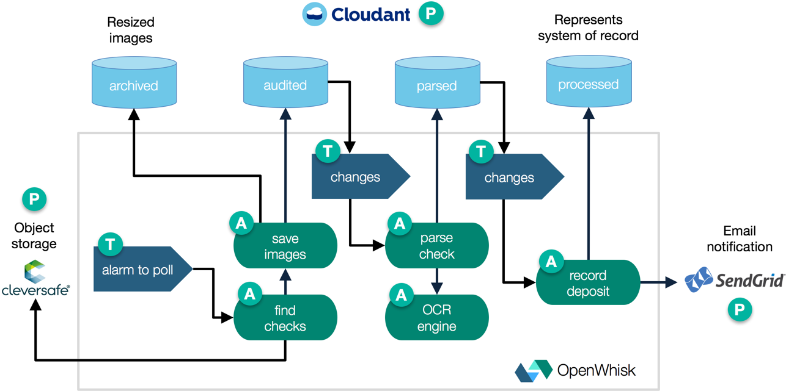

# Automatic check processing with OpenWhisk
This proof of concept shows how OpenWhisk can be used for an event-driven architecture that processes the deposit of checks to a bank account.

It is currently built on the public Bluemix service and relies on Cloudant and SoftLayer Object Storage. On premises, it could use CouchDB and OpenStack Swift. Other storage services could include FileNet or Cleversafe.

## Basic flow
This PoC uses a set of actions, triggers, and rules to process images that are added to an object storage service. When new checks are detected a workflow downloads, resizes, archives, and reads the checks then it invokes an external system to handle the transaction.

* A mobile app user or teller at a bank branch scans and places an image into an object storage service (the `incoming` container) named with the customer email, deposit to account, amount of the check, and timestamp encoded in the file name, for example, `krook@example.com^12345679^19.99^1475597757.jpg`
* A `poll-for-incoming-checks` trigger invokes the `find-new-checks` action every 20 seconds to poll the object storage service for new check images. (An alternative implementation can use an OpenStack Swift webhook to push this event instead of polling).
* This `find-new-checks` action queries the object storage service. For each file found, it invokes the `save-check-images` action asynchronously.
* The `save-check-images` action downloads the image and puts two resized copies (50% and 25% scaled) into an `archive` CouchDB database and the original in an `audit` database. When all inserts have completed successfully, the files are deleted from the object storage service.
* A `check-ready-to-scan` change trigger on the `audit` CouchDB database invokes a `parse-check-data` action to process the full size image.
* This `parse-check-data` action retrieves the image, then calls the `parse-check-with-ocr` Docker action to read the from account information and routing number. If it can't read this information, the check is flagged as needing additional human review. It stores the results into a `parsed` CouchDB database.
* A `check-ready-for-deposit` trigger is then fired by that change to the `parsed` database and invokes another action, `record-check-deposit`.
* This `record-check-deposit` action retrieves the account details from the `parsed` record, logs the transaction in the `processed` database and sends an email with SendGrid (simulating connectivity to external system).

## Sample check images
There are two checks in the `images` directory that the OCR action can read reliably right now.

Notice the MICR data at the bottom of the check representing the routing number and deposit from account.

The amount data is not currently parsable, nor is the deposit to account information. This will need to be passed as metadata.

## Technical details
Most of the actions are written in JavaScript using the default Node.js version 6 environment on Bluemix. One of the actions is written as a shell script and packaged in a Docker container. This shows both the polyglot nature of OpenWhisk, as well as the ability to package any arbitrary program, as is needed in this case to leverage an OCR library.
